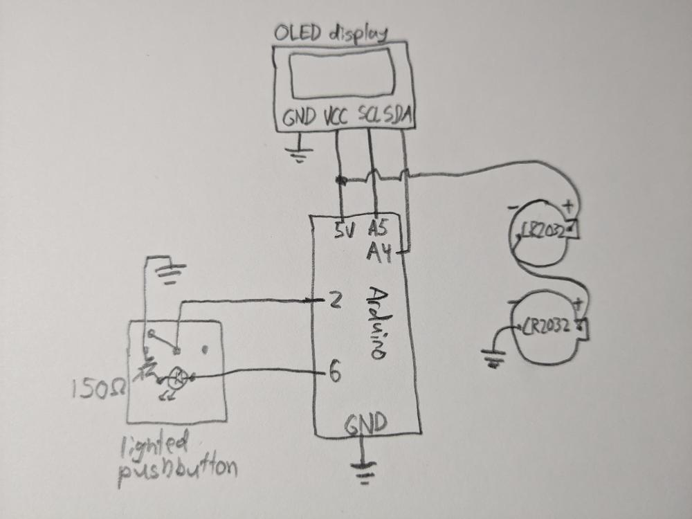
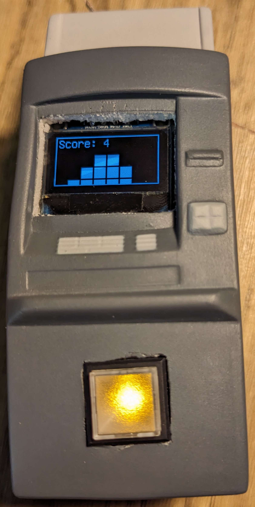
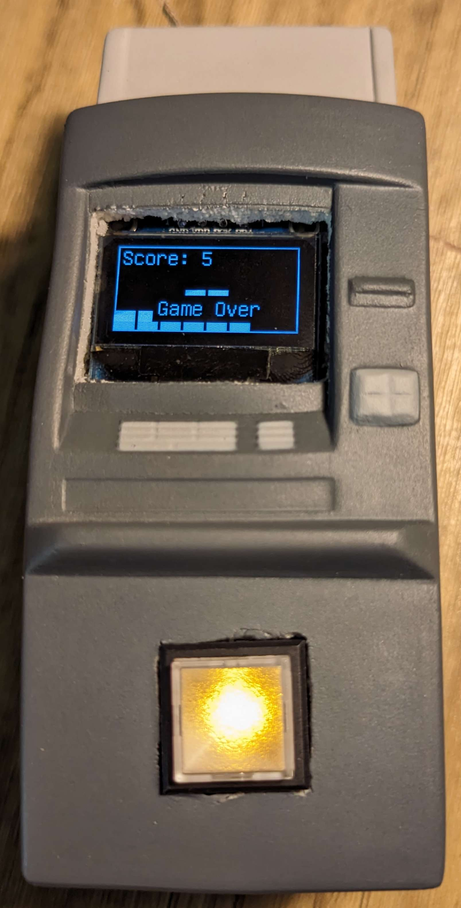

A mini replica of the arcade stacker game!

Uses a knockoff arduino nano (which actually turned out to be a pro mini with USB duct taped on), a 128x64 OLED display, a lighted pushbutton switch, and of course a foam stress toy. Since this arduino can operate from 3-6V, I ran it at 6V by connecting two CR2032 coin cell batteries, of which I have lots of extras [for some reason...](https://johanv.net/ATinyGame)

    <iframe title="Foam Stacker - handheld arduino game!" width="1120" height="630" src="https://makertube.net/videos/embed/b06bbbde-5826-4853-b6d7-4860670b0c1a" frameborder="0" allowfullscreen="" sandbox="allow-same-origin allow-scripts allow-popups allow-forms"></iframe>

View the arduino code on [Codeberg](https://codeberg.org/johanvandegriff/FoamStacker).

    
    
    

