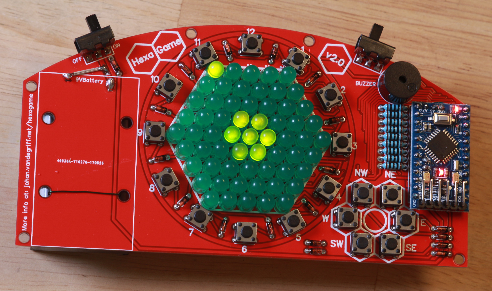
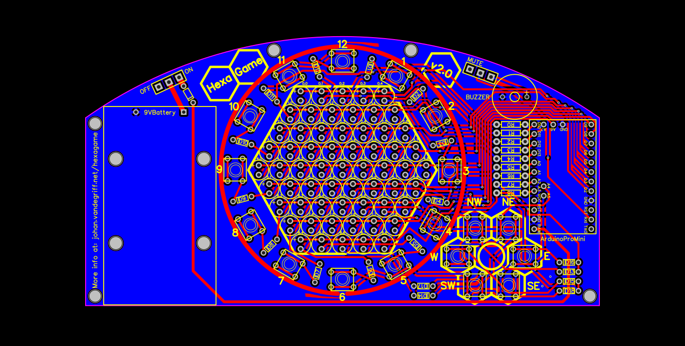
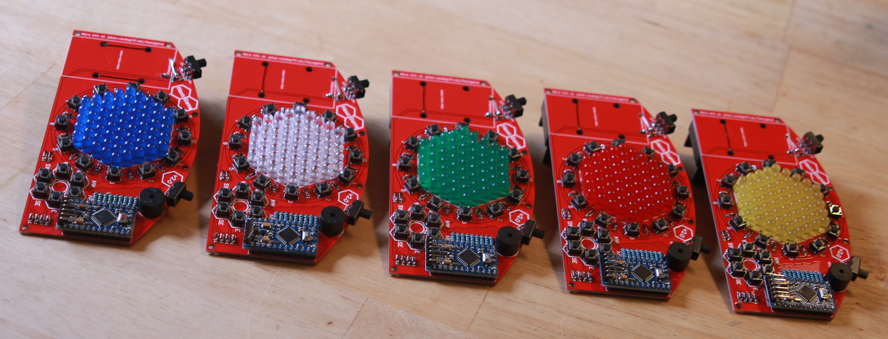
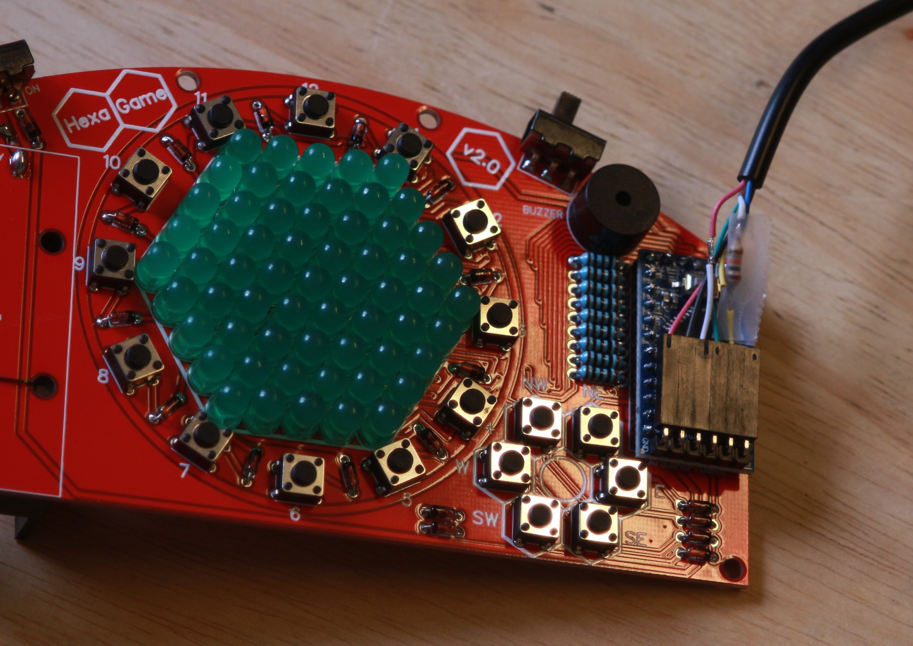
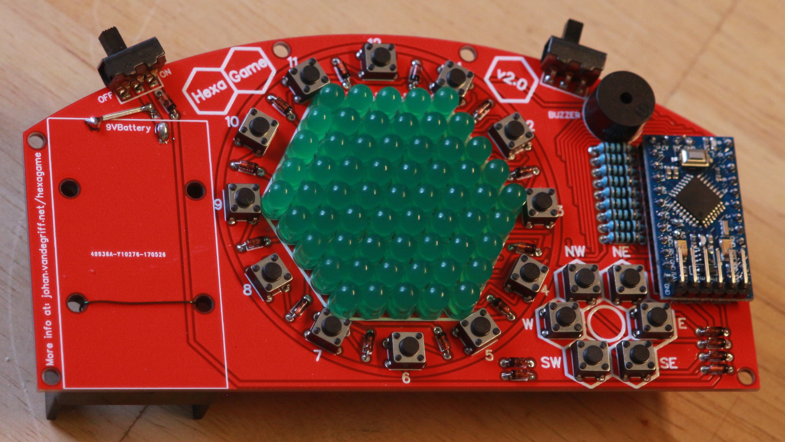
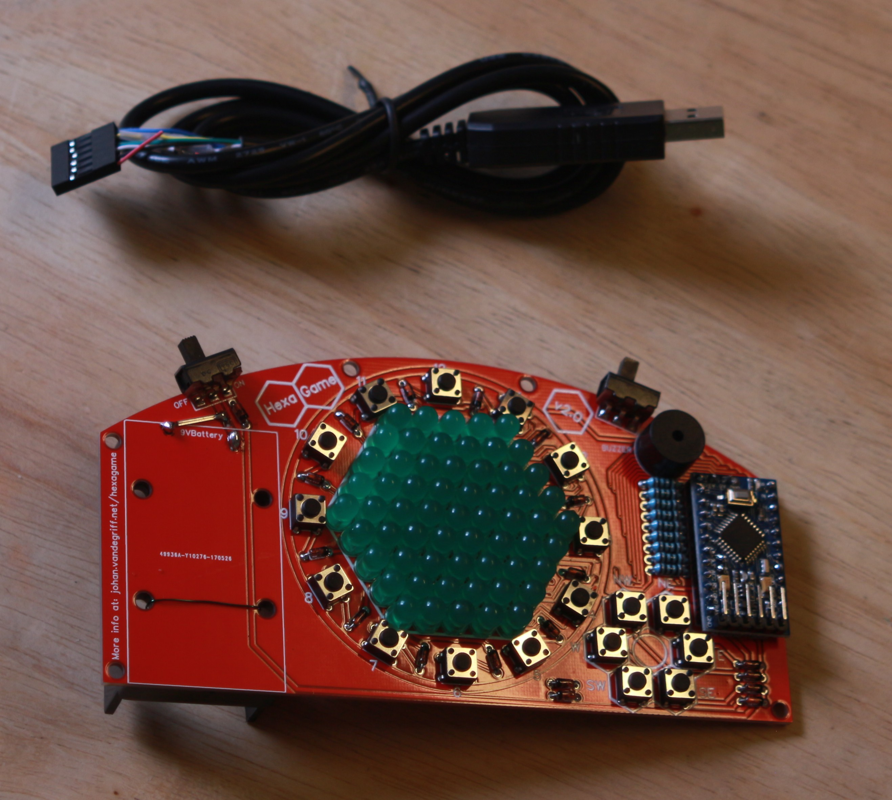
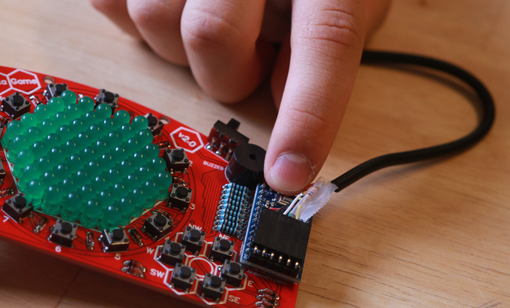

HexaGame is a handheld multi-game system that consists of a hexagon of LEDs with buttons surrounding it, as well as a hex-shaped dpad.

## Board Designs
 * [Version 1.0 on EasyEDA](https://oshwlab.com/jjvan/HexaGame-20cb40f4409741ecbd005d839ab8d0a7)
 * [Version 2.0 on EasyEDA](https://oshwlab.com/jjvan/HexaGame_v2_0-0fb707684ff844ab90d4a03ce570e539)

## More Photos

